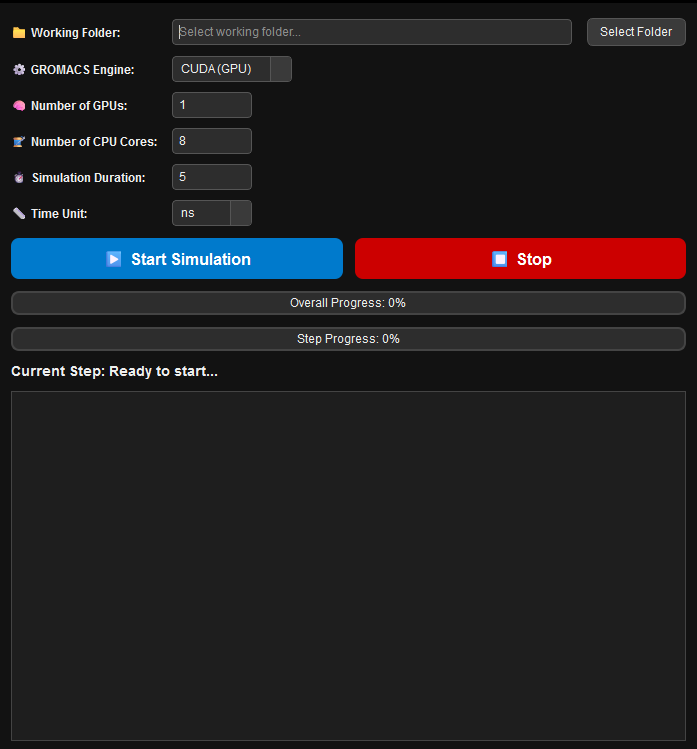

gmxauto 

<!-- badges: start -->
[](https://opensource.org/licenses/MIT)
[]()
[]()
[]()
[]()
[]()
<!-- badges: end -->

A PyQt6-based GUI application for automating GROMACS 2025.1 molecular dynamics simulations on Windows, supporting both CUDA GPU and CPU builds. Designed to streamline running MD simulations prepared with CHARMM-GUI.



## Table of Contents
- [Features](#features)
- [Recommended Workflow](#recommended-workflow)
- [Installation](#installation)
- [Usage](#usage)
- [Supported Platforms](#supported-platforms)
- [Troubleshooting](#troubleshooting)
- [License](#license)
- [Acknowledgments](#acknowledgments)
- [Contact](#contact)

## Features

- **Intuitive Windows GUI** - User-friendly interface built with PyQt6
- **GROMACS 2025.1 Support** - Compatible with both CUDA GPU and CPU builds
- **Workflow Automation** - Automates multi-step MD simulations from CHARMM-GUI inputs
- **Real-time Monitoring** - Live progress tracking and output logging
- **Checkpoint Handling** - Automatically resumes interrupted simulations
- **Performance Optimization** - Smart GPU/CPU resource allocation and parameter tuning
- **Cross-Platform Ready** - Modular architecture for future Linux/macOS support

## Recommended Workflow

1. **System Preparation**  
   Generate input files (.gro, .top, .mdp) using [CHARMM-GUI](https://www.charmm-gui.org/):
   - Recommended versions: CHARMM-GUI v3.8+
   - Use "GROMACS" format during export
   - Include all required force fields

2. **Application Setup**  
   ```bash
   # Clone repository
   git clone https://github.com/Arifmaulanaazis/gmxauto.git
   cd gmxauto
   ```

3. **Configuration**  
   - Load your CHARMM-GUI prepared folder
   - Select hardware configuration (GPU/CPU)
   - Set simulation duration (ns/ps)

4. **Simulation Execution**  
   - One-click workflow automation:
     1. Energy Minimization
     2. Equilibration
     3. Production MD
   - Automatic parameter optimization
   - Checkpoint handling for long runs

5. **Analysis**  
   - Outputs saved in structured directory:
     - Trajectory files (.xtc, .trr)
     - Log files (.log)
     - Checkpoint files (.cpt)
   - Compatible with common analysis tools (VMD, PyMOL, MDAnalysis)

## Installation

### Requirements
- **OS**: Windows 10/11 (64-bit)
- **Python**: 3.8+ (Recommend Anaconda/Miniconda)
- **GROMACS**: Version 2025.1
   - Use the prebuilt Windows binary with CUDA GPU support from: [GROMACS 2025.1 Prebuilt Windows CUDA](https://github.com/Arifmaulanaazis/Gromacs-Prebuild-Windows/)
   - This prebuilt includes CUDA 12.1 support for NVIDIA GPUs and is compiled with Visual Studio 2022.

- **GPU Users**: 
  - NVIDIA CUDA Toolkit 12.0+
  - Driver version 535+

### Setup Steps
1. Install Python dependencies:
   ```bash
   pip install pyqt6
   ```

2. Configure GROMACS:
   - Select the CPU or GPU (CUDA) option on the GUI.
   - Gromacs is automatically added to your PATH when you run gmxauto 

3. (Optional) For GPU support:
   - Install CUDA Toolkit
   - Verify CUDA detection:
     ```bash
     nvidia-smi
     ```

4. Clone and run:
   ```bash
   git clone https://github.com/Arifmaulanaazis/gmxauto.git
   cd gmxauto
   python main.py
   ```

## Supported Platforms

| Component       | Minimum Requirements           | Recommended                   |
|-----------------|---------------------------------|-------------------------------|
| CPU             | x86_64, 4 cores                | AMD/Intel 8+ cores            |
| GPU             | NVIDIA Pascal (GTX 1000+)      | Ampere (RTX 3000+) with FP32  |
| RAM             | 8 GB                           | 32 GB+                        |
| Storage         | SSD with 10 GB free            | NVMe SSD                      |

## Troubleshooting

**Common Issues:**
- *GROMACS not found*: Verify PATH configuration
- *CUDA initialization error*: Check driver compatibility
- *Simulation crashes*: Validate .mdp files with CHARMM-GUI

**Logging:**
- Application logs: `gmxauto.log`
- GROMACS outputs: `step*.log` in working directory

**Performance Tips:**
- Use 1 GPU per 4 CPU cores for optimal balance
- Allocate 2-4 GB RAM per core
- Prefer NVMe storage for large trajectories

## License

Distributed under MIT License - see [LICENSE](LICENSE) for details.

## Acknowledgments

- GROMACS Development Team ([@gromacs](https://www.gromacs.org/))
- CHARMM-GUI Developers ([@charmm-gui](https://www.charmm-gui.org/))
- PyQt Project ([@pyqt](https://www.riverbankcomputing.com/software/pyqt/))
- NVIDIA CUDA Toolkit ([@nvidia](https://developer.nvidia.com/cuda-toolkit))

## Contact

**Arif Maulana Azis**  
- Email: [titandigitalsoft@gmail.com](mailto:titandigitalsoft@gmail.com)
- GitHub: [@Arifmaulanaazis](https://github.com/Arifmaulanaazis)
- Project Repository: [gmxauto](https://github.com/Arifmaulanaazis/gmxauto)

For feature requests or bug reports, please open a [GitHub issue](https://github.com/Arifmaulanaazis/gmxauto/issues).
